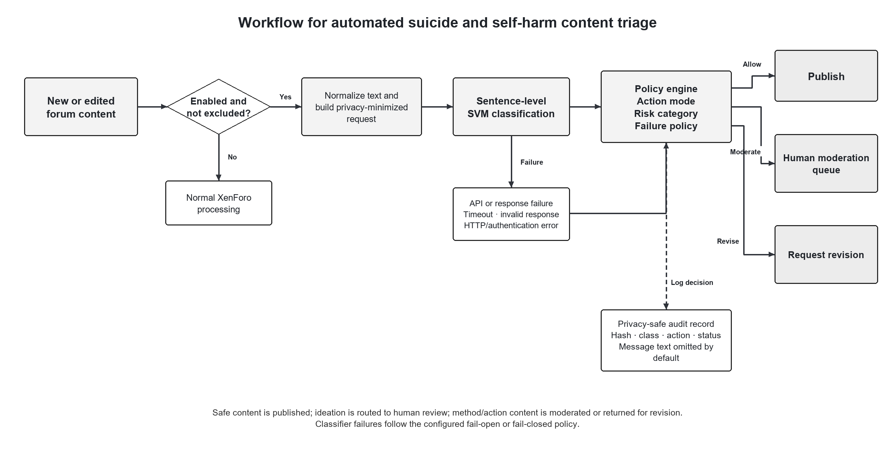

# SuicideSelfHarmDetector-XenForoPlugin

A XenForo 2.3 add-on for integrating a self-managed suicide and self-harm text classifier into a human-supervised moderation workflow.

The machine-learning, deep-learning and transformer research scripts and aggregate evaluation results are maintained separately in the [MHFSafeguard research repository](https://github.com/sharmapn/MHFSafeguard).

## Status

**Research prototype / staging candidate.** The code is targeted at **XenForo 2.3.0+** and has automated PHP, Python, JSON and XML static checks. It should still be installed and exercised on a non-production XenForo 2.3 site before production deployment because XenForo itself is proprietary and is not included in this repository's CI environment.

## Classifier used by the reference backend

`dev_server/server.py` is now designed for the final **Linear SVM** pipeline produced by the companion training workflow:

```text
Suicide_SVM_pipeline.joblib
```

The saved sklearn pipeline contains the fitted `CountVectorizer`, `TfidfTransformer`, and `LinearSVC`. The model file is intentionally not committed to this public repository. On the classifier server, set:

```text
MHFS_MODEL_PATH=/protected/path/Suicide_SVM_pipeline.joblib
```

The research classifier is sentence-level. The API adapter therefore splits a full XenForo message into sentences, classifies each sentence, and aggregates the result using the priority:

```text
Method/action > Ideation > Not harmful
```

`LinearSVC` does not provide calibrated probabilities. The API's score is a decision-function ranking proxy and **must not be interpreted as a clinical probability**. For the final SVM backend, moderation is primarily label-driven.

See [`dev_server/README.md`](dev_server/README.md) for backend setup and deployment.

## Research categories

The classifier distinguishes three categories:

1. **Not Ideation or method or action** (`Not Suicide post` internally)
2. **Suicide or Self Harm Ideation**
3. **Method or action of Suicide, Self-Harm or Harming others**

The add-on is intended to support moderators, not replace them.

## Workflow

```text
User submits thread / reply / edit
        |
        v
XenForo's normal spam checks
        |
        v
MHFSafeguard intercepts otherwise-visible content
        |
        v
BBCode/text normalisation
        |
        v
Classifier API request
        |
        v
Sentence-level SVM classification + aggregation
        |
        v
Allow / log / native XenForo moderation / revision request
        |
        v
Privacy-conscious scan audit record
```



Publication assets: [journal figure (SVG)](docs/figures/journal-process-diagram.svg) · [journal figure (PNG)](docs/figures/journal-process-diagram.png) · [detailed process and scenarios (SVG)](docs/figures/detailed-process-diagram.svg) · [detailed process and scenarios (PNG)](docs/figures/detailed-process-diagram.png).

These are explanatory diagrams, not screenshots. The journal figure summarizes the enforcement workflow; in `log` mode every classifier label is allowed without changing XenForo's publication decision. See the policy table below for the exact mode-dependent behavior.

## Real XenForo screenshots

The following images were captured from **XenForo 2.3.12** in a browser using XenForo's native **Light** appearance on **2026-09-04**. They show the installed **MHF Safeguard 0.2.0** add-on, not interface mock-ups. The planned user-facing name is **SuicideSelfHarmDetector**; the rename is not implemented in these captures.

The latest explicit-method input, moderation, and revision screenshots were retaken with a **1920 × 1080 desktop viewport**, replacing the narrow side-panel captures. These show browser page content, not the address bar or operating-system window frame. The older overview screenshots retain their original dimensions.

All forum examples are synthetic local test content, not real member disclosures. The API-key field was masked in the unsaved browser form before capture; no credential is included in these images. The temporary revision test was followed by restoring `log` mode, fail-open behavior, and message/raw-response storage off.

### Normal publication


### Human moderation


The first queue item retains its original “Normal Thread” title but was subsequently edited to harmful test content in scenario H. It is not evidence of a benign-content false positive.

### Explicit self-harm method/action example

The category title is **“Suicide or self harm method or action - synthetic test”**. The user-supplied synthetic message explicitly names a self-harm method and a time frame:

> I want to slit my wrists tonight.


The message-only classifier probe and the live XenForo submission returned `method_or_action`. XenForo queued the thread in `moderate` mode and displayed the revision warning in `revise` mode. The revision submission created no additional thread, post, or scan row. [View the exact input screenshot](docs/screenshots/light/09-explicit-method-input.png).

**Observed limitation:** a separate probe of “I attempted suicide yesterday.” returned `ideation`, despite describing an action. The successful screenshot is a demonstration, not an accuracy evaluation. All three probes, including the previous self-harm action example, are documented in the [sentence-level validation note](docs/validation/method-action-examples.md).

### Revision request


This is XenForo's native validation dialog. Its background dimming is part of the actual UI. The wording mentions highlighted language, but **inline sentence highlighting is not implemented**.

See the [full light-theme screenshot gallery and scenario notes](docs/screenshots/README.md) for configuration, privacy controls, the installed add-on, and fail-open/fail-closed examples. These figures document local staging behavior, not production readiness or clinical validity.

## Repository structure

```text
SuicideSelfHarmDetector-XenForoPlugin/
├── README.md
├── upload/
│   └── src/addons/Pankaj/MHFSafeguard/
├── dev_server/
│   ├── server.py
│   ├── requirements.txt
│   └── README.md
├── docs/figures/       # Explanatory process diagrams (PNG/SVG)
├── docs/screenshots/   # Real local XenForo browser captures
├── docs/images/        # Earlier conceptual interface mock-ups
└── .github/workflows/static-checks.yml
```

## XenForo add-on structure

```text
upload/src/addons/Pankaj/MHFSafeguard/
├── addon.json
├── Setup.php
├── Content/
├── Gateway/
├── Pipeline/
├── Repository/
├── XF/Service/
│   ├── Post/
│   │   ├── PreparerService.php
│   │   └── EditorService.php
│   └── Thread/
│       ├── CreatorService.php
│       └── ReplierService.php
└── _data/
```

The class extensions use the XenForo 2.3 `*Service` class names.

## API contract

The add-on sends one cleaned XenForo message plus non-identifying content context to the configured API endpoint. User ID and username remain local to XenForo and are not sent to the classifier:

```json
{
  "platform": "xenforo",
  "source": "mhf_safeguard_plugin",
  "context": {
    "content_type": "post",
    "content_id": 12345,
    "thread_id": 456,
    "node_id": 12,
    "title": "Thread title",
    "is_first_post": false
  },
  "message": "Cleaned message text",
  "message_hash": "sha256_hash",
  "return_spans": true,
  "return_sentences": true
}
```

A successful response contains at least:

```json
{
  "risk_level": "high",
  "recommended_action": "moderate",
  "highest_label": "method_or_action",
  "highest_score": 94,
  "flagged_parts": []
}
```

A 2xx response missing required fields is treated as an API failure rather than silently allowing the content.

## Moderation policy

| Add-on mode | Not harmful | Ideation | Method/action |
|---|---|---|---|
| `log` | publish + log | publish + log | publish + log |
| `moderate` | publish | moderation queue | moderation queue |
| `revise` | publish | moderation queue | request revision |

The moderation queue is XenForo's native moderated-content workflow. The current revision response is a generic XenForo validation message. The older interface illustrations under `docs/images/` are **design mock-ups**, not implemented AdminCP/front-end pages; the captures under `docs/screenshots/` show the actual implemented UI.

## Configuration

The add-on provides options for:

- enabling/disabling scanning;
- classifier API URL;
- optional bearer-token API key;
- action mode (`log`, `moderate`, or `revise`);
- secondary moderation/revision thresholds for alternate backends;
- API timeout;
- fail-open behaviour;
- storage of message text/raw responses;
- forums excluded from classification.

For the final SVM adapter, harmful decisions are label-driven. The threshold values should not be read as calibrated SVM probabilities.

## Privacy defaults

The add-on is configured to minimise persistence and transmission of sensitive forum data:

- user ID and username are **not sent** to the classifier API;
- cleaned message storage is **off by default**;
- raw API response storage is **off by default**;
- when message storage is off, flagged-part text is stripped before database logging;
- a SHA-256 message hash is retained for audit/deduplication purposes.

If raw text storage is intentionally enabled for controlled debugging, restrict database access and apply an appropriate retention policy.

## Installation

Copy the contents of `upload/` into the XenForo installation root so that the add-on lands at:

```text
src/addons/Pankaj/MHFSafeguard/
```

Then:

1. install/enable **MHF Safeguard** in the XenForo Admin Control Panel;
2. deploy the classifier API separately;
3. point `Classifier API URL` to `/api/classify`;
4. configure the same bearer token on XenForo and the API server;
5. begin in `log` mode on a staging site;
6. confirm thread creation, replies, edits, excluded forums, API failure behaviour, native moderation, and scan logging before enabling moderation/revision in production.

## Deployment notes

The XenForo request waits synchronously for the classifier API. For production, keep the classifier endpoint close to the forum server, use HTTPS when traffic crosses a network, use a strong API key, and keep the configured timeout conservative.

`dev_server/server.py` uses Flask for the application but should be served by a production WSGI server (for example Waitress) rather than Flask's built-in development server.

## What is not implemented yet

The core interception, classifier call, policy decision and audit-table logging are implemented. The following are not yet full product features:

- a dedicated AdminCP scan-log browser;
- inline highlighting of individual risky sentences in the XenForo editor;
- a moderator dashboard built from the interface mock-ups;
- calibrated SVM probabilities.

These limitations do not prevent native XenForo moderation, but they should not be mistaken for completed UI features.

## Research companion

Model-development code and final aggregate evaluation results:

**https://github.com/sharmapn/MHFSafeguard**

## Safety

This software processes sensitive mental-health content and can produce false positives and false negatives. Keep human review in the moderation loop and do not use classifier output as a clinical assessment or diagnosis.
