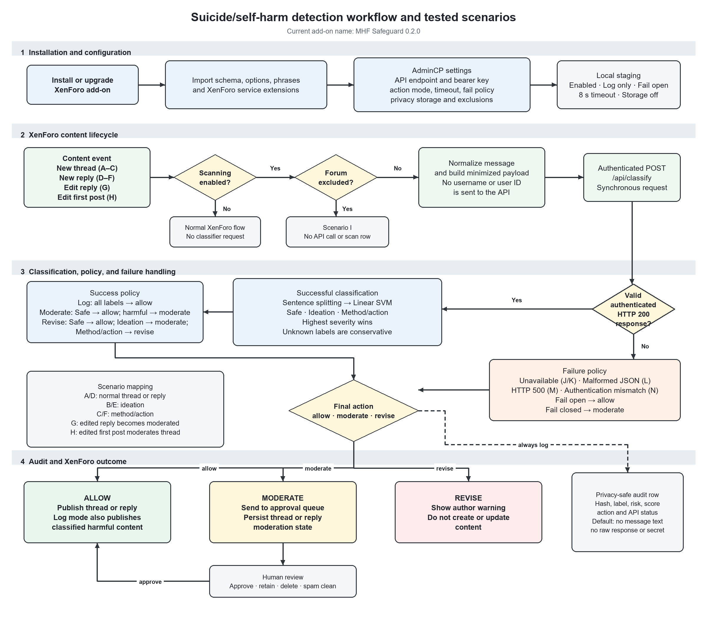

# Process figures

These existing white-background diagrams accompany the real browser screenshots in `../screenshots/`. They are explanatory figures, not screenshots of a dedicated plug-in dashboard.

- `journal-process-diagram.svg` / `.png`: simplified, monochrome workflow suitable for a paper draft.
- `detailed-process-diagram.svg` / `.png`: installation, runtime flow, action modes, privacy logging, and scenario mapping.

The SVG files retain editable vector text and shapes. The PNGs were exported at 300 DPI: journal 2600 × 1350 pixels; detailed 2400 × 2100 pixels. Use the SVG for scaling where the journal's submission workflow supports it. These diagrams were retained from the prior figure-generation step; the new browser captures are in `../screenshots/light/`.

The journal figure summarizes enforcement behavior. In `log` mode, all classifications leave the normal publication decision unchanged; in `moderate` mode both harmful categories are queued; in `revise` mode ideation is queued and method/action content prompts revision. Backend failures follow the configured fail-open/fail-closed policy.

Suggested caption: **Workflow of a XenForo-integrated suicide and self-harm content triage system. Sentence-level SVM predictions are combined with configured action and failure policies to allow publication, route content to human moderation, or request revision, with privacy-minimized audit logging.**

These figures describe a research prototype and do not establish diagnostic accuracy, clinical validity, or production readiness.

## Journal process diagram

[PNG](journal-process-diagram.png) · [Editable SVG](journal-process-diagram.svg)

## Detailed process and scenario diagram

[PNG](detailed-process-diagram.png) · [Editable SVG](detailed-process-diagram.svg)
