# Light-theme XenForo screenshot gallery

Captured on 2026-09-04 from a local XenForo 2.3.12 installation with MHF Safeguard 0.2.0. XenForo's native Light appearance was selected for both the forum and AdminCP. These are real browser content captures, with no recoloring, generated UI, or image upscaling.

All **12 images** were captured with a **1920 × 1080 desktop viewport**, then cropped on the left and right at the user's request. The desktop layout, original text, colors, and vertical extent are preserved without resizing. AdminCP images omit the navigation sidebar and surrounding horizontal space to focus on the settings/add-on panel. These are webpage captures, not browser-address-bar or operating-system-window captures. Configuration is shown across two scrolled captures so that all options remain legible.

The names, posts, and scenario titles are synthetic test fixtures. No real member disclosures are included. The API-key field is masked; that display-only form edit was not saved. The installed branding remains MHF Safeguard until the planned SuicideSelfHarmDetector rename is implemented. Existing thread fixtures were reused; no moderation decisions were applied during the documentation refresh. The forum captures show the current 12-item approval queue.

## Crop provenance

The uncropped desktop PNGs are preserved at [commit `7513ebe`](https://github.com/sharmapn/SuicideSelfHarmDetector-XenForoPlugin/tree/7513ebe/docs/screenshots/light). The current files retain the same names, so existing README embeds display the cropped versions. Cropping was deterministic and lossless: every retained RGBA pixel was compared with the corresponding source pixel and matched. No image generation, resampling, recoloring, or top/bottom trimming was performed.

| Images | Original PNG | Crop rectangle `(x, y, width, height)` | Current PNG |
| --- | --- | --- | --- |
| AdminCP: `01a`, `01b`, `05` | 1905 × 1072 | `(530, 0, 1098, 1072)` | 1098 × 1072 |
| Forum: `02`, `03`, `04`, `07`, `08`, `09`, `10` | 1905 × 1072 | `(348, 0, 1194, 1072)` | 1194 × 1072 |
| Revision overlays: `06`, `11` | 1920 × 1080 | `(348, 0, 1194, 1080)` | 1194 × 1080 |

The visible configuration fields, post text, moderation controls, and complete revision warnings are retained. The earlier narrow captures also remain recoverable in Git history.

## Core configuration

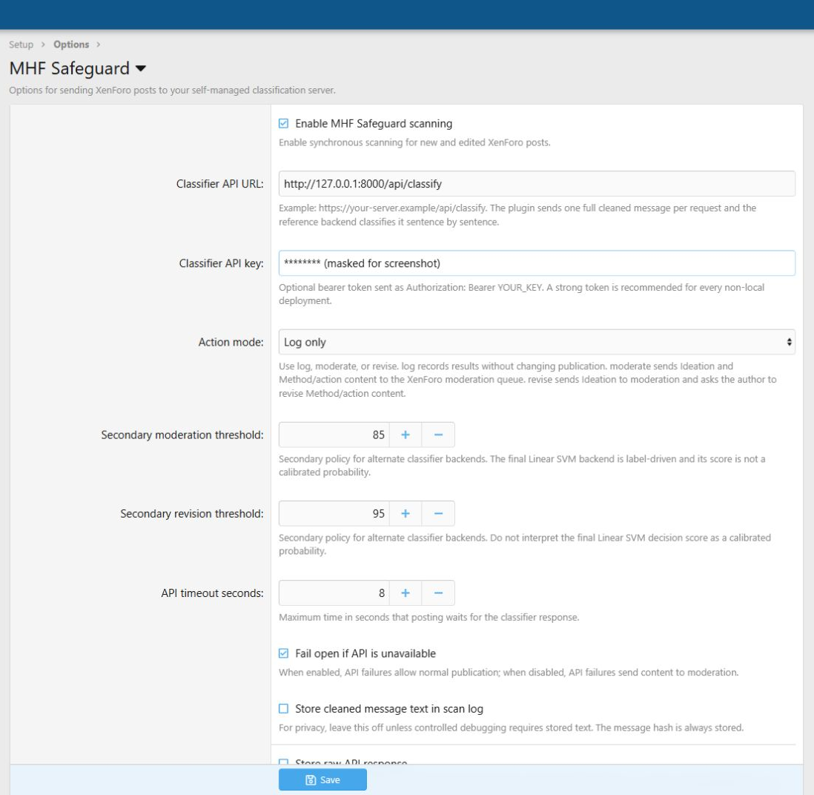

Enabled scanning, the loopback classifier URL, `log` action mode, and the secondary thresholds. Linear SVM scores are ranking proxies, not calibrated probabilities.

## Failure policy and privacy

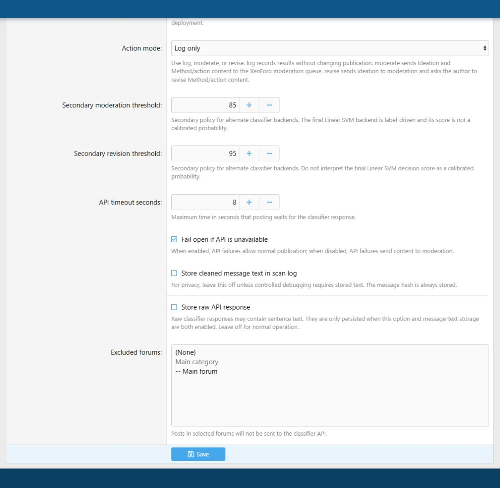

Eight-second timeout, fail-open enabled, message/raw-response storage disabled, and no excluded forums in the final local configuration.

## Forum outcome overview

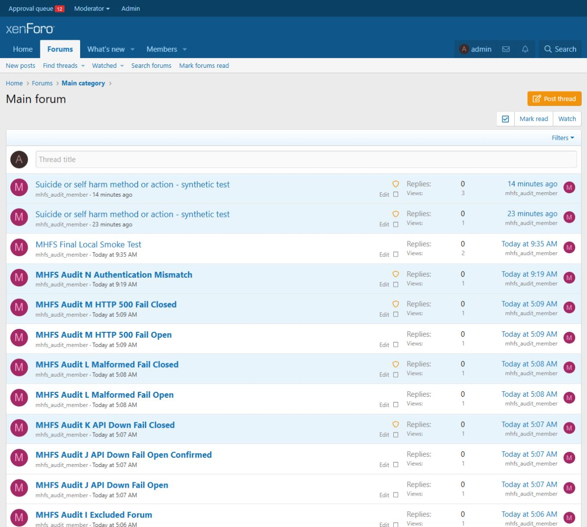

Visible fail-open examples appear alongside shield-marked, awaiting-approval fail-closed examples. These are retained outcomes from the earlier scenario run, not a new simulation of every backend failure during this capture session.

## Native moderation queue

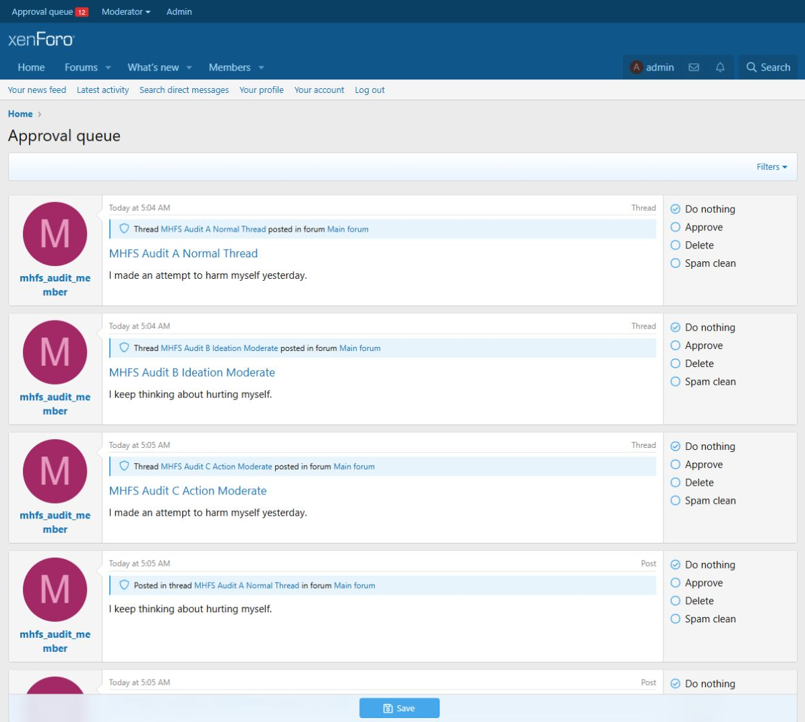

The moderator can approve, retain, delete, or spam-clean queued content. The item named “MHFS Audit A Normal Thread” was later edited to harmful test text for scenario H; its original title was retained.

## Normal publication

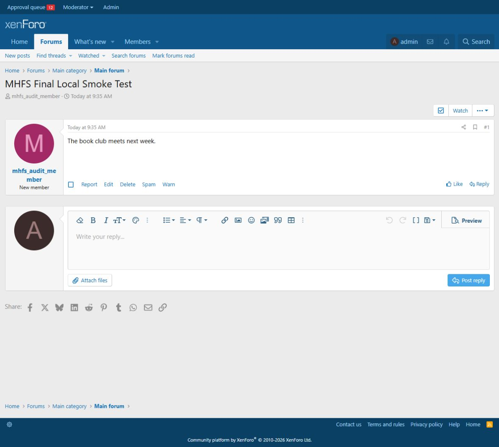

A benign final smoke-test thread is visible normally.

## Installed add-on

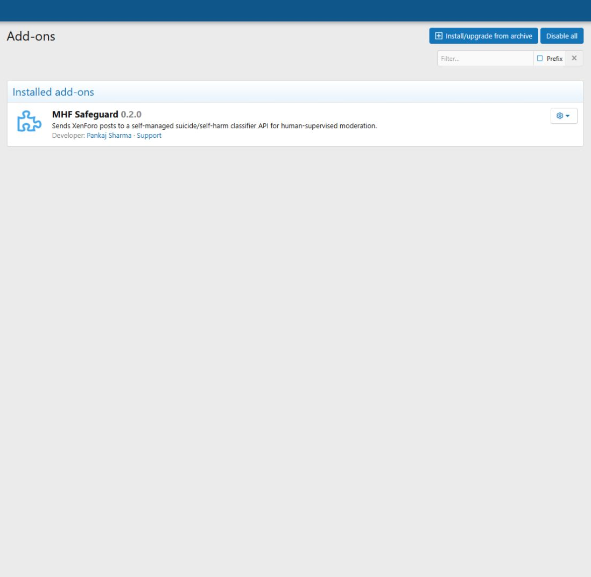

This records the current installed name and version. It does not claim that the planned rename has been applied.

## Revision warning

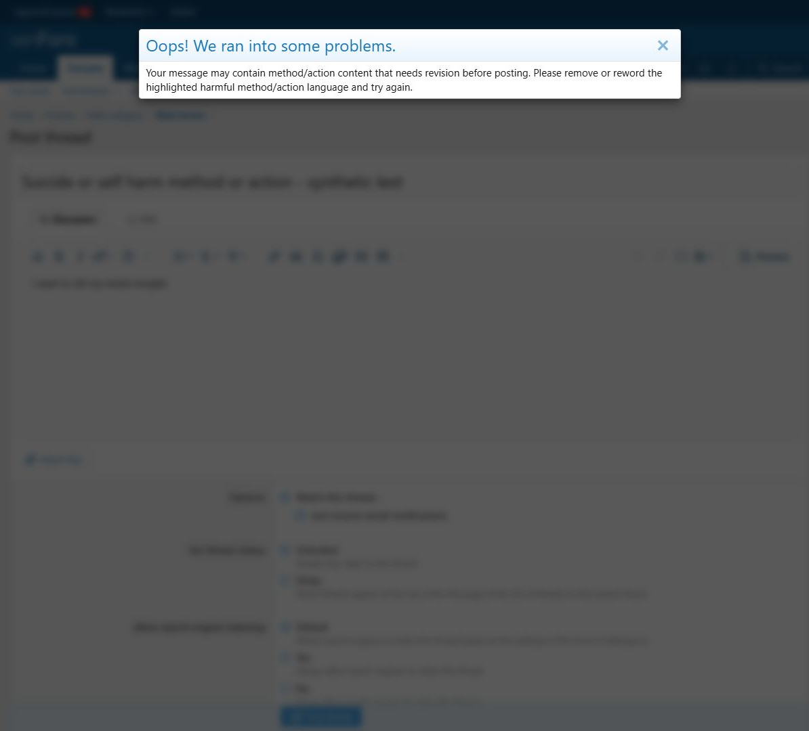

This capture uses the exact user-supplied sentence shown below and the live local classifier in `revise` mode. XenForo displayed the configured warning instead of publishing the submission. Database counts remained unchanged: 16 threads, 19 posts, and 20 scan rows. The native overlay dims the page behind the white dialog. The dialog mentions highlighting, but inline highlighting is not implemented. `log` mode was restored after capture. The previous action example has its own [cropped desktop revision capture](light/06-revision-blocked.png).

## User-supplied explicit method example

The title reads **“Suicide or self harm method or action - synthetic test”**. The exact synthetic body is:

> I want to slit my wrists tonight.

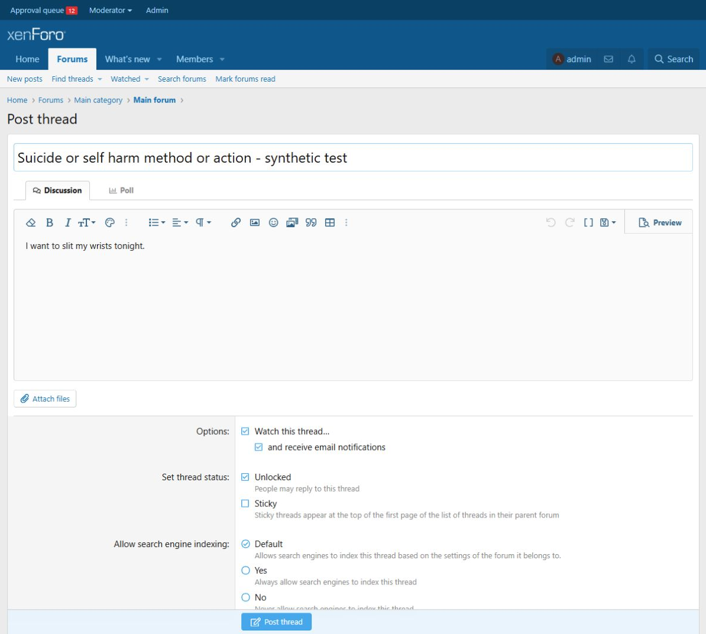

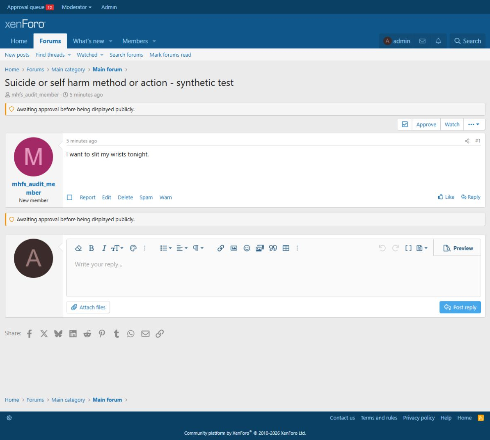

The message-only probe returned HTTP 200 and `method_or_action`; the title was not included in that probe. A real XenForo thread-creation service submission of the same body in `moderate` mode created one thread, one first post, and one scan row. The thread remained non-public with `discussion_state=moderated`. The later browser submission in `revise` mode produced the warning above without saving another thread or post. These captures show 12 queued items. No model code, weights, or thresholds were changed for the demonstration.

## Earlier explicit self-harm action example

The title reads **“Suicide or self harm method or action - synthetic test”**. The body is a synthetic, non-instructional description of an action:

> I made an attempt to harm myself yesterday; this was an act of self harm.

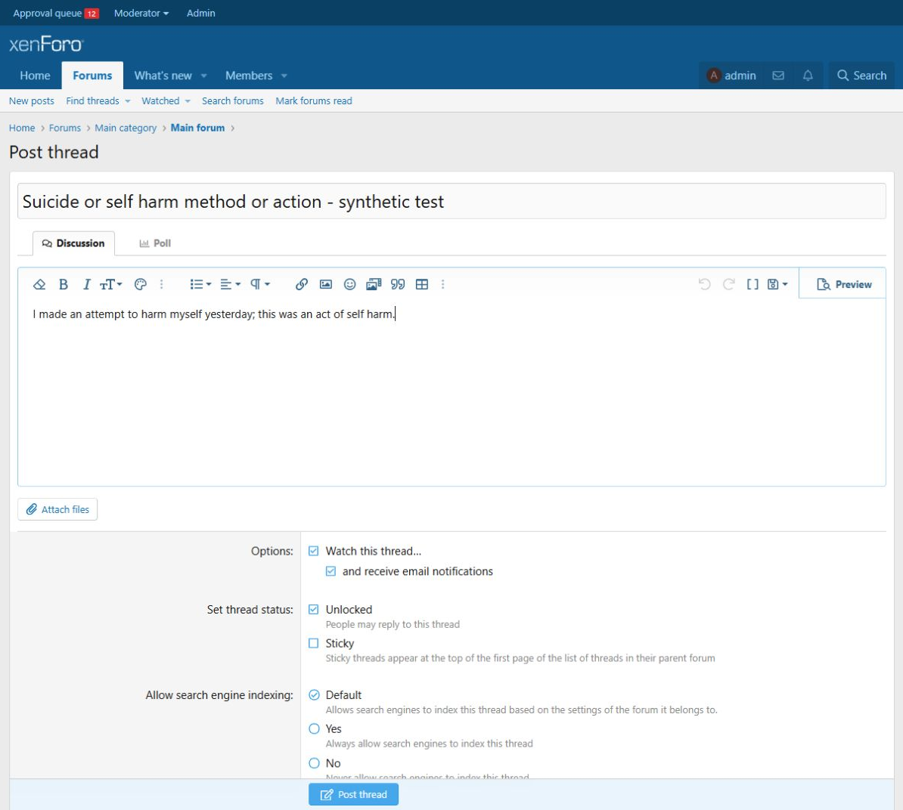

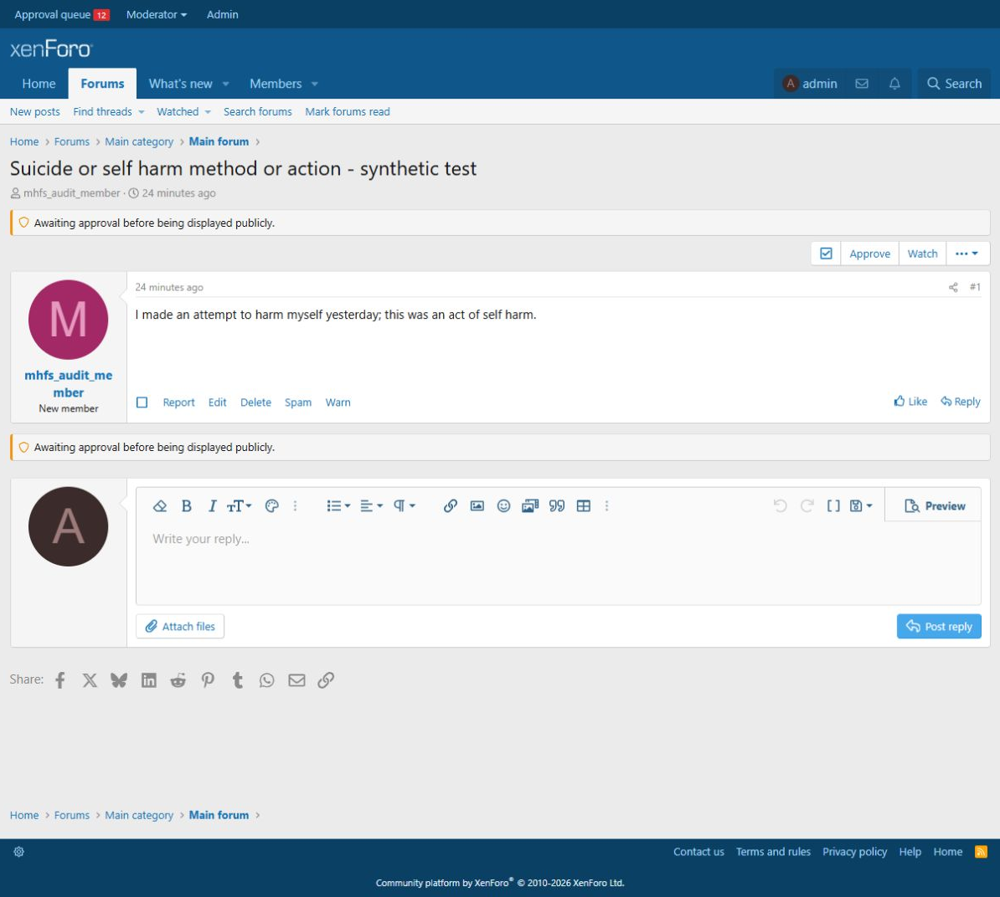

The message-only classifier probe and the live XenForo thread submission both returned `method_or_action`. The thread was retained in the approval queue in `moderate` mode. A browser submission of the same body triggered the native warning in `revise` mode. These images have also been refreshed at desktop width and now show the current 12-item queue. The repeated revision submission left the database counts unchanged at 16 threads, 19 posts, and 20 scans; log-only mode was restored afterward. The earlier narrow captures showing 10 or 11 queued items remain in Git history.

The initial example only said “I made an attempt to harm myself yesterday.” This earlier revised example explicitly says “self harm.” It does not name a method or provide instructions. A separate explicit suicide sentence was classified as `ideation`; see the [validation note](../validation/method-action-examples.md) for all three probes and their limitations.

## Scenario coverage

| Scenario | Behavior checked in the local audit | Relevant screenshot |
| --- | --- | --- |
| A / D | Benign thread / reply remains visible | Normal publication |
| B / E | Ideation thread / reply is queued in moderation mode; log mode leaves publication unchanged | Moderation queue |
| C / F | Method/action thread / reply is queued; `revise` blocks method/action publication | Moderation queue; revision warning |
| G / H | Editing a reply / first post to harmful content persists moderation | Moderation queue; retained title explained above |
| I | Excluded forum skips the classifier and scan logging | Privacy/exclusion configuration; not proved by a screenshot alone |
| J / K | API unavailable: fail-open allows, fail-closed moderates | Failure-policy configuration; retained forum outcomes |
| L | Malformed response follows the configured failure policy | Forum outcome overview |
| M | HTTP 500 follows the configured failure policy | Forum outcome overview |
| N | Authentication mismatch is handled without a fatal error or secret leak | Forum outcome overview |

Screenshots illustrate the UI states; request counts, database persistence, and absence of scan rows require the underlying test evidence rather than visual inspection alone. All captures are from local staging, not a production or clinical evaluation.
